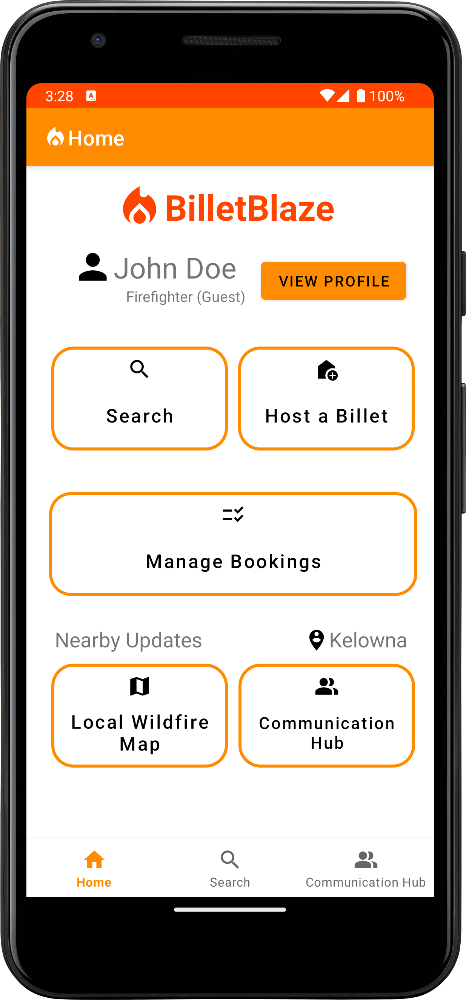

# BilletBlaze - Wildfire Billeting App
COSC 341 Group 11 project

## Overview of System Features
Searching for available billets ([Robert](https://github.com/robertyac)):
This task is where we allow the user to search for a billet based on their desired specifications such as location, date and number of guests. A scrollable cardview result set has all of the available billeting options.

Booking a billet ([Oliver](https://github.com/olivernicholass)): 
This task allows the user to book and pay for an available, selected billet for a specified time range and as such allows the user to view a summary of their requested billet and change any details before allowing them to pay for their booking. 

Hosting a Billet: ([Tanner](https://github.com/tannerdyck))
This task should allow the user to list their property/location in the app. Within this task, the user can create a listing and set parameters such as availability, description and price.

Managing bookings: ([Stefan](https://github.com/Stefans217))
Within this task, the user can view all of their bookings. From there, the user should be able to view, modify or cancel any existing bookings. From this task, viewing past bookings and leaving a review of the listing is also possible.

Communication hub ([Stefan](https://github.com/Stefans217) & [Robert](https://github.com/robertyac)):
The communication hub task is where depending on the user, they can communicate with billet hosts/billet users of any upcoming or current bookings. Within the communication hub, there is a news section with important real-time updates from local official authorities with any pertinent nearby wildfire updates. 

### Running in Android Studio
In order to run this GitHub repo in Android Studio just create a file named **local.properties** under Gradle Scripts with the location of your Android SDK 
with the following line:

sdk.dir=/Users/YOURUSERNAME/Library/Android/sdk

MAPS_API_KEY=AI.... (this is your maps API key) The placeholder is the manifest (don't need to change that)
You will also need to set the run configurations to the defaults in the button next to the virtual device button 
